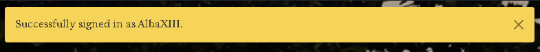
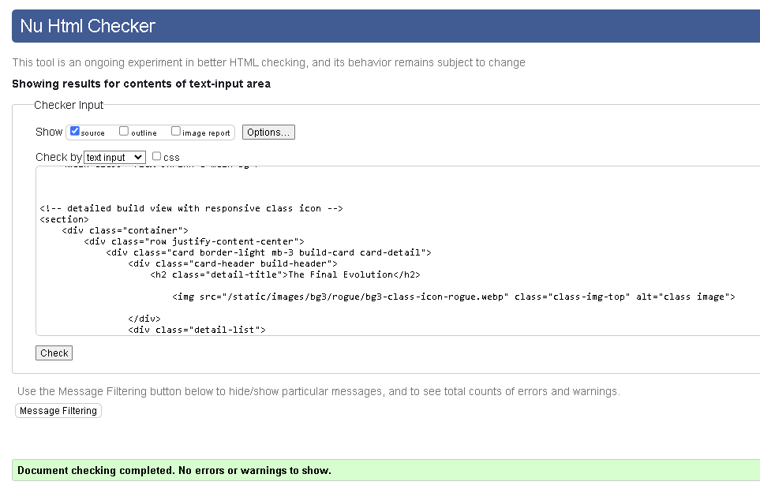

# Build.mt

## INTRODUCTION

build.mt is an online catalogue for the collection, sharing and review of character builds in role-playing games (RPGs). Many modern RPGs have an overabundance of character creation options, with many diverging paths, abilities, spells, gear – it’s enough to confuse many casual fans or first time players trying RPGs for the first time. built.mt is designed to take the stress out of choosing how to play a character. Prospective players can create an account, share their characters and how they play, strengths and weaknesses, and most of all – how fun they are to play! 

To summarise, build.mt is character inspiration made simple.

build.mt was designed initially with Larian’s 2023 release ‘Baldur’s Gate III’ in mind - but future realeases would include many of today's most popular and feature-rich RPGs, with From Software’s 2022 release ‘Elden Ring’ being the first to be added.

This is my fourth Code Institute project and was developed using HTML, CSS, JavaScript, Python, Django, and PostgreSQL. 

View the live website [here](https://build-mt-7c3508717c5e.herokuapp.com/).

## TABLE OF CONTENTS

1. [User Experience (UX)](#user-experience-ux)
    - [Strategy](#strategy)
    - [Site Goals](#site-goals)
    - [Ideal User](#ideal-user)
2. [User Stories & Methodology](#user-stories--methodology)
    - [Agile Working](#agile-working)
    - [Milestones/EPICs](#milestonesepics)
    - [User Stories](#user-stories)
    - [User Visitor Goals](#user-visitor-goals)
    - [User Member Goals](#user-member-goals)
    - [Admin Goals](#admin-goals)
3. [Design](#design)
    - [Wireframes](#wireframes)
    - [Color Scheme](#color-scheme)
    - [Fonts](#fonts)
    - [ERD](#erd---drawsql)
4. [Features](#features)
    - [NavBar](#navbar)
    - [Footer](#footer)
    - [Home Page](#home-page)
    - [Build List](#build-list)
    - [Searchbar](#search-bar)
    - [Add Build](#add-build)
    - [Build Detail](#build-detail)
    - [Edit & Delete Build](#edit--delete-build)
    - [Favourite Function](#favourite-build)
    - [Comment Section](#comment-section)
    - [My Builds](#my-builds)
    - [Favourite Builds](#favourite-builds)
    - [Account Interaction](#account-interaction)
    - [Error Pages](#error-pages)
5. [Security](#security)
    - [Env.py](#envpy)
    - [Defensive Measures](#defensive-programming-measures)
    - [Input Validation](#input-validation)
6. [Bugs & Issues](#bugs--issues)
    - [Known Bugs & Issues](#known-bugs--issues)
    - [Unfixed Bugs & Issues](#unfixed-bugs--issues)
7. [Future Features](#future-features)
8. [Testing](#testing)
    - [Validators](#validators)
    - [Lighthouse](#lighthouse)
    - [Manual Testing](#manual-testing)
9. [Deployment](#deployment)
    - [Local Deployment](#local-deployment)
    - [Evironmental Variables](#environmental-variables)
    - [Heroku Deployment](#heroku-deployment)
    - [Forking & Cloning](#forking--cloning)
10. [Technologies Used](#technologies-used)
    - [Main Software](#main-software)
    - [Modules](#modules)
    - [Django Imports](#django-imports)
    - [Additional Software](#additional-software)
11. [Credits and Acknowledgements](#credit--acknowledgements)
    - [Image Credits](#image-credits)
    - [Code Inspiration](#code-inspiration)
    - [Special Thanks](#special-thanks)

-----------------------------
 
## USER EXPERIENCE

### Strategy 

build.mt is designed to be an accessible and simple-to-use collection of character builds. Visitors will be able to peruse the builds at leisure, whilst authenticated site members will be able to log in and add their own, as well as like or share their favourites.

### Site Goals

* To provide **all users** with access to a build repository, with an organised list of build articles featuring structured and easy to understand information.
* To provide **all users** with the ability to sign up to the website and create an account.
* To provide **authenticated users** full CRUD functionality to upload and remove their own build to the database.
* To provide **authenticated users** the ability to like, share, comment and review other people’s build submissions.
* To provide site **administrators** the ability to approve comments, remove builds, and control user access.

### Ideal User

The ideal user of the site would be someone who is interested in starting to play role-playing games, and/or an experienced user who would be looking to experiment with new builds should they be wracked for ideas or wanting to try something new when playing their favourite games. Modern role-playing games are often incredibly complex and resources surrounding them can also be daunting to understand, so the ideal user would come to build.mt to have the process streamlined, and gain fun and interesting builds to try. The ideal user would also embrace the humour of the community, and as such the site is designed to be a knowing and fun place to be.

-----------------------------

## USER STORIES & METHODOLOGY

### Agile Working

Before starting the coding on build.mt, I created a custom user story template and linked it to the project Kanban board, to allow me to create an iterative and fluid development and deployment schedule. The use of the board allowed me to isolate applications and functions of the code and work on them in iterative sections, whilst keeping track of the status of each particular function of the code.

### Milestones/EPICs

7 Milestones were created at the beginning of the project, and from there the user stories were extracted. Each milestone was further categorised into feature sections, then further linked to the priority user stories subcategory on the project Kanban board.

1. Initialise setup
2. Build Catalogue 
3. User Registration
4. Build interaction
5. Build submission
6. Build collation
7. Site owner objectives

### User Stories

Each user story was linked to the project template with 3 completion benchmarks (as base, number of acceptance criteria extends depending on user story) as a criteria to for adequate completion of the story;

Using **project**;

As a **visitor/user/admin** I can **ability** in order to **result**

### Completion Benchmark

**CB1**

**CB2**

**CB3**

The list of user stories can bee viewed on the ‘completed’ tab of the project kanban board, but also viewable below;

- Initialise Django Setup
- Create Database
- Deploy to Heroku
- Create database admin superuser
- Create base html & styles
- Add static files and directories
- Create BG3 build list
- Create BG3 detailed build page
- Search via keyword
- Create & register user accounts
- Create a build post
- Moderate posts
- Leave comments on builds
- Moderate comments
- Add build to favourites
- View account & favourite builds
- Create ER detailed build page
- Create home app directory 
- Add 404 & 403 page
- Detailed testing 
- Detailed testing 
- Complete README documentation

Furthermore, each user story is categorised into it’s relevant EPIC, to provide as clear working pathway and thorough planning of each individual app on the website.

### User Visitor Goals

- As a site visitor I would like to understand the purpose of the website when first accessing the home page.
- As a site visitor I would like to be able to view builds posted to the database.
- As a site visitor I would like to understand the registration process is mandatory to add my own builds.
- As a site visitor I would like to be able to easily create my own account and notified that I am logged in.

### User Member Goals 

- As a site member I can log into my account using the login button on all pages.
- As a site member I would like to see if I am still logged in.
- As a site member I would like to be able to upload my own builds using the built-in submission page.
- As a site member I would like to be able to edit and delete my posted builds once logged in.
- As a site member I can add comments to other builds in the database.

### Admin Goals

- As a site administrator I can approve comments left on individual builds.
- As a site administrator I can utilise full CRUD functionality on all posts on the database.

-----------------------------

## Design

### Wireframes 

Wireframes for all HTML templates were created using [Balsamiq Wireframes](https://balsamiq.com/). These designs were used as the design basis of all html template pages.

### Color Scheme

The color scheme was designed using [Coolers.co](https://coolors.co/). The primary colors used in this project are dark greys and gold, remeniscent both of the branding of Baldur's Gate itself as well as the color of treasure - a staple of any fantasy setting.

### Fonts

The main font used in the project is 'Libre Baskerville' - based on American Type Founder's Baskerville from 1941 and chosen again for it's proximity to the font used in the BG3 branding but also because it gives a antiquitean feeling to the website whilst also looking clean and grandiose.

### ERD - DrawSQL

The main Entity Relationship Diagram (ERD) for the project was designed using the web service [DrawSQL](https://drawsql.app/). This diagram was used as the basis for the main Bgbuild database model for both individual instances of single builds and the comment model in relation to each individual build. Although some tweaks were made to the fields in place for the main model, this diagram was the single point of reference across the planning stage for the project.

-----------------------------

## FEATURES

### NavBar

The NavBar element is everpresent across all pages as part the of base html of the site and sets the visual tone of the website. On the left-hand side, the site name is shown with an implemented color scheme as well as a custom designed icon for some flair, and to provide an appealing indicator of the site's purpose - as well as providing a constant link back to the home page.

The NavBar links on the right are organised in a reactive collapsable style, so as when the user is utilising the site on a smaller device the links fold into a hamburger menu, which will then dropdown the links when clicked.

When logged out, the user will have the option to go straight to the Build list and view the builds, or they can click login or register to access the relevant account functionality. When logged in, the account username is shown in place of the register link, and becomes a nested dropdown that stores links to the users' submitted builds and favourites.

### Footer 

Also part of the base html is the footer, which is styled inline with the NavBar for consistent branding. Inside the footer is a copyright notice, as well as an actionable link to the developer (my) Github page.

### Home Page

The home page serves as the first access point to the website, being linked to an empty URL redirecting traffic to the index. Utilised as the background is a loading page of Baldur's Gate III - an image of fantasy wilds with a bustling city in the background. Across the middle is the site branding, with contrasting fonts and colors, and a link to the build list page. Both of these elements combine to show a prospective user the purpose of the site in a clear manner as well as establishing the visual style of the product from the first click.

### Build List

The main build list is the main meat of the website. All submitted builds are displayed in bootstrap card format, listed by 4 to a row and paginated by 8, so most viewports will have an uncluttered view of the builds on display. Each build displays the number of comments and favourites attatched to it, as well as if the auth user has favourited. At the bottom of each build, there is a reactive button link to the build detail.

Each build card has a header, an image related to the build, and a few lines of information outlining the key points to the build - namely build name, role, base class, and a humerous exerpt summarising the build.
Also present in each build is a reactive class image - this variable template is linked to the main class of the database entry, so it will change depending on the base class used. 

The user who uploaded the build is listed in the bottom of the build information.

Inside the build list, the builds are listed from newest onwards. Any unnaproved builds are listed with italics and the explore button deactivated, showing clear and obvious build moderation.

### Search Bar

At the top of the build list page there is a search bar - linked to show the result of a filter query to the database for class name and build role. Users can enter a class name, e.g 'cleric' and the site will return a page rendered with the result of the filtered query.

### Add Build

Below the search bar on the build list page is a clear call to action to upload a build through a button marked with a 'plus' symbol. This will redirect unauthenticated users to register, and authenticated users to the add build form.

Once accessed, the add build form is a straightforward display of the Bgaddbuild form. Each field is clearly marked with large font and spacing.

The build slug field is intentionally hidden with a linked javascript script containing a slugify function - the content of the text page is automatically rendered in the hidden slug field without any uppercase letters or special characters (either removing them or replacing them with dashes). This is coded to take place on keyupstroke, so potential users will not see anything happening in the UX view.

Within the inputs, there is a image field - this is linked to a Cloudinary database configured in the site settings. Users can upload a custom image, but the field is optional - if there is no image found the placeholder BG3 game image will be rendered in it's place.

As the build form has a lot of potential variables - each class has at least 3 subclasses - the form is controlled by a javascript script which reveals relevant build information when certain eventlisteners are fulfilled, so if the user has chosen a Barbarian class, the Barbarian subclass field will be revealed, and then hidden when a new class is chosen.

This process is also used on the multiclass field.

Also present is a link back to the main build list page for users to return if desired.

### Build Detail

The build detail page once accessed has the result of each add build form displayed in an accessible format, with the information being presented in a visually appealing and straightforward manner.

The fields are, build name, role, base class, subclass, level split, key ability, secondary key ability, suggested skill, secondary suggested skill, difficulty and a text box for detailed descriptions.

### Edit & Delete Build

Below the main build information but contained within the card body, there are two buttons which allow authenticated build post owners to either edit or delete their builds.

Edit build will take users to the add build form, where they can adjust the fields of their build and resubmit to the database. Once reposted, a Django message will inform the user of their successful edit.

Delete build will redirect authenticated users to a delete confirmation page - letting the users know that the action is permanent and irreversible.

### Favourite Function

Below the card body with the build information, the number of comments and favourites is displayed. The favourite button is reactive depending on the authentication state of the user - if the user is unauthorised, the favourite button will be hidden and just the number of favourites will be shown, but if the user is logged in the button will be available. Furthermore, if the user has already favourited the build, the button will be red to show previous interaction with the build. Users can favourite and unfavourite at will.

### Comment Section

Contained below the build detail is the comment form. Authenticated users are able to leave comments on each build post, with a Django message confirmation shown after each comment. Comments are displayed within another card, listed by user and submission time & date.

### My Builds

Authenticated users, once logged in, can access a list of their submitted build by clicking on their account name and the 'my builds' link in the dropdown list. This page display is a filtered queryset showing only builds that have been created by the user, displayed in the same manner as the main build list.

### Favourite Builds

Also within the authenticated user dropdown is the favourite builds tab. As above, this filters the main model to only display the builds with a relevant many-to-many field accessed by the authenticated user, and again shown in the same manner as the main build list.

### Account Interaction

Using Django's Allauth system, users can register, login and logout at their convenience. These pages have solid backgrounds to provide a visual distinction to the main site and ensure the user is focused when inputting any sensitive information.

### Error Pages

Continuing the visual theme of the account pages, the site has custom styling for 403, 404 and 500 error pages. When accessed, these pages will display the error and provide users a clear link back to the home page.

-----------------------------

## SECURITY

### Env.py

Sensitive information, such as API and secret keys, contained within the env.py file are hidden from deployment and therefore unable to be accessed by outside actors.

### Defensive Programming Measures

Utilised within the code are several authentication measures such as , barring anauthenticated users from accessing areas roped off for site memebers.

Within the Django class-based views the security based mixins - LoginRequiredMixin, UserPassesTestMixin, SuccessMessageMixin - are used for extra protection against unauth users gaining access to areas marked for users only.

### Input Validation

Within the account forms and add build form there is input validation built in, disallowing users from submitting empty fields. 

Furthermore, for the difficulty rating, the max number validator is in place to stop users submitting a value above 5.

-----------------------------

## BUGS & ISSUES

### Known Bugs & Issues

**Reply Form**
As part of the build detail view, the initial plan was to include a secondary reply form rendered within the comment form to allow users to reply to single instances of comments and create mini-threads. I implemented the following BgReply model within bgbuild\models.py;

    class Bgreply(models.Model):
        """
        User can reply to comments related to :model:`auth.User`
        and :model:`bgbuild.Bgcomment
        """
        comment = models.ForeignKey(
            Bgcomment, on_delete=models.CASCADE, related_name="replies")
        user = models.ForeignKey(User, on_delete=models.CASCADE)
        reply_body = models.TextField()
        created_on = models.DateTimeField(auto_now_add=True)
        id = models.CharField(
            max_length=100, default=uuid.uuid4,
            unique=True, primary_key=True, editable=False)

        class Meta:
            ordering = ["created_on"]

        def __str__(self):
            return f"{self.user} : {self.reply_body}"

And the implemented the model into the form;

    class BgreplyForm(forms.ModelForm):
    """
    Reply form rendered in build detail page.

    """
    class Meta:
        model = Bgreply
        fields = ('reply_body',)

And built it into the build detail view;

    def build_detail(request, slug):
        """
        Display an individual :model:`bgbuild.Build`

        **Context**

        ``build``
            A single instance of :model:`bgbuild.Build`.
        ``comments``
            All comments related to the build.
        ``comment_count``
            A count of comments related to the build.
        ``comment_form``
            Instance of BgcommentForm
        ``reply``
            All replies related to the comment

        **Template:**

        :template`bgbuild/bgbuild_detail.html`
        """
        queryset = Bgbuild.objects.filter(status=1)
        build = get_object_or_404(queryset, slug=slug)
        comments = build.comments.all().order_by("-created_on")
        comment_count = build.comments.count()

        if request.method == 'POST':
            comment_form = BgcommentForm(data=request.POST)
            reply_form = BgreplyForm(data=request.POST)
            if 'comment' in request.POST:
                comment = comment_form.save(commit=False)
                comment.user = request.user
                comment.build = build
                comment.save()
                messages.add_message(
                    request, messages.SUCCESS,
                    'Comment posted'
                )
            elif 'reply' in request.POST:
                comment_id = request.POST['comment_id']
                comment = Bgcomment.objects.get(id=comment_id)
                reply = reply_form.save(commit=False)
                reply.user = request.user
                reply.comment = comment
                reply.save()
                messages.add_message(
                    request, messages.SUCCESS,
                    'Reply posted'
                )

        comment_form = BgcommentForm()
        reply_form = BgreplyForm()

        return render(
            request,
            "bgbuild/bgbuild_detail.html",
            {
                "build": build,
                "comments": comments,
                "comment_count": comment_count,
                "comment_form": comment_form,
                "reply_form": reply_form,
            },
        )

Implemented into the HTML Template below the comment section;

    
                            

                                 
                                

                                    

                                        {{ reply.reply_body }}
                                    

                                     
                                    

                                        Reply by {{ reply.user }} {{ reply.created_on }}
                                    

                                

                            

                            

                            
                            
                                <h4>Leave a reply</h4>
                                
replying as {{ user.username }}

                                <form class="replyForm" method="post"
                                    style="margin-top: 1.2em;">
                                    {{ reply_form | crispy }}
                                    
                                    <input type="submit"
                                    class="btn btn-signup btn-lg btn-return" name="reply">
                                    <input type="hidden" value="{{ comment.id }}" name="comment_id">
                                </form>
                            

The original planning for this feature was to send a second hidden value containing the comment id to the view, which would then differentiate between the two POST requests coming from the same page and reassign the value accordingly. That way, one comment could have attatched to it a number of single instance replies - a small step toward full comment thread systems as desired for future versions.

When applied, this method worked and provided the desired functionality, as seen below;

However, when validated through the W3 HTML checker during final checks, the method I have used to reuse the same form without a prefix or formset led to the reuse of several HTML Div ids provided by the crispy form input. This led to the failure of any commented page when put through the W3 validator due to the multiple duplication of the containing div id, and the id of the text body.

In my time troubleshooting this issue I looked into using Javascript to dynamically rename the text box and containing div with an iterating value, so every comment would contain a unique reply form body and containing div, but this didn't bind the way I had hoped it to. The next stage was to look into creating a formset which could group the forms up or, deploy a prefix to each form which could iterate up. Sadly due to time constraints I was not able to fully implement this system.

With all this in mind I removed the reply form from the comment section from the final submitted project as to not fall foul of **LO1  1.7 - HTML code should be fully validated**. In future releases I will implement a seperate model for the reply functionality and ensure that, as part of a formset or with a iterating prefix, the elements will remain individual and seperate when deployed as part of the final product.

**Search Bar**

The search bar function returns results only when the input is fully in lowercase. I believe this is due to the filter used only accepting exact matches to the dropdown tuple used. This issue will be worked on for future releases.

**Form Resubmission**

Upon manual an auth user leaving a comment and manually reloading the page, the form resubmits and sends the comment a second time. This is unlikely to be encountered by an average user but will be fixed in future realeases by adjusting the comment view.

### Unfixed Bugs & Issues

None unknown as of time of submission.

-----------------------------

## FUTURE FEATURES 

By design, build.mt is envisioned as a framework wherein extra games can be plugged in to the system through quite simple processes. With this in mind, I had originally hoped to include From Software's 2022 release 'Elden Ring' in intial deployment as an additional build catalogue - however time constraints affected this plan. However this is still an option for ongoing development.

As well as the fixing of the reply section - further interaction with the comment section was also planned, for example allowing users to edit and delete their comments.

Allowing users to sort the build list page by class or build role is also planned to be implemented in the future.

Adding models for equipment and weapons to add further fields to the main model to further customise the build.

-----------------------------

## TESTING

### Validators

**HTML**

All pages passed through [W3 HTML validator](https://validator.w3.org/) with no issues apart from the ones described below.

INDEX

BUILD LIST

BUILD DETAIL

ADD BUILD

MY BUILDS

FAVOURITES

LOGIN

LOGOUT

REGISTER

4 errors flagged by validator related to Django Crispy forms and are in areas of the HTML that are pre-built and unaccessible developer side. On further investigation into the errors revealed that some of the errors are showing up only in W3. Running the same page back in [minifier HTML validator](https://www.minifier.org/html-validator) brought no errors;

For example error 2 has no basis in the code;

    <ul><li>Your password can’t be too similar to your other personal information.</li><li>Your password must contain at least 8 characters.</li><li>Your password can’t be a commonly used password.</li><li>Your password can’t be entirely numeric.</li></ul>

Page passed through no issues apart from the above.

**CSS**

CSS passed through [Jigsaw W3 CSS](https://jigsaw.w3.org/css-validator/) validator with no issues.

**JavaScript**

All JavaScript passed through [jshint](https://jshint.com/) with no errors.

**Python**

All Python code passed through **[Flake8](https://flake8.pycqa.org/en/latest/)** & **[pycodestyle](https://pypi.org/project/pycodestyle/)** in VScode with no issues;

All Python code also passed through CI PEP8 Compliance tester;

 

Settings.py throws up 4 x line length errors - these lines are pre-packaged from Django initialisation and unmodified by the developer.

### Lighthouse

**DESKTOP**

**MOBILE**

### Manual Testing

**USER STORIES**
| User Story      | Acceptance Criteria | Expected Outcome  | Pass/Fail 
| ----------- | ----------- | ----------- | -----------
| [#3 Deploy Early](https://github.com/AlbaXIII/build.mt/issues/3) | Deploy early to Heroku | Site deployed | PASS
| [#6 Create Build List](https://github.com/AlbaXIII/build.mt/issues/6) | Build list created with basic build overview & reactive class images | Build list displays rows with relevant information paginated into groups | PASS
| [#8 Create Detailed Build View](https://github.com/AlbaXIII/build.mt/issues/8) | Individual builds in list can be opened from list view to detail view | Detail view displays all relevant information clearly | PASS
| [#9 Search Builds by Keyword](https://github.com/AlbaXIII/build.mt/issues/9) | Builds in buildlist can be searched by keyword at tope of page | Search returns filtered list with number of entries | PASS (see [known Bugs & Issues](#known-bugs--issues))
| [#11 Register User Accounts](https://github.com/AlbaXIII/build.mt/issues/11) | User can register for account | allauth function allowing registration | PASS
| [#12 Submit Build](https://github.com/AlbaXIII/build.mt/issues/12) | Auth users can access add build form with success message and account validation | On login add-build form accessed through build list | PASS
| [#13 Moderate Builds](https://github.com/AlbaXIII/build.mt/issues/13) | Install Summernote, show builds awaiting approval | Builds submitted with draft status, clear visual indicators | PASS
| [#14 Leave Comment on Build](https://github.com/AlbaXIII/build.mt/issues/14) | Users can submit comment, published immediately | Crispy form build into build detail view, message indicates success | PASS
| [#15 Add Build to Favourites](https://github.com/AlbaXIII/build.mt/issues/15) | Authenticated users can see favourite button, add to favourites when browsing build detail view | Model field implemented for favourite -> user relationship, favourites added to seperate account page | PASS
| [#16 Edit or Delete Uploaded Builds](https://github.com/AlbaXIII/build.mt/issues/16) | Build submitters can see edit/delete functionality on build detail view | updated or deleted builds reflected in build list and in database admin view | PASS
| [#18 View Account and Favourited Builds](https://github.com/AlbaXIII/build.mt/issues/18) | Site member can access pages through NavBar with submitted builds and favourited builds | Account pages available through NavBar with filtered object lists | PASS
| [#19 Create Home Page](https://github.com/AlbaXIII/build.mt/issues/19) | Create index as home page landing area for new site users | Site base URL takes user through to index.html | PASS
| [#24 Upload Pictures With Build Submissions](https://github.com/AlbaXIII/build.mt/issues/24) | Allow users to upload their own images using Cloudinary and have reactive class icons on build list view | Cloudinary image field implemented and operational on add build form, base_class changes build list/detail class icon | PASS

**NAVBAR**
| **Test**    | **Action** | **Expected Outcome**  | **Pass/Fail** | **Comments** |
| ----------- | ----------- | ----------- | ----------- | ----------- |
| NavBar displays brand icon/home link, register, login and build links for first time user | Logout as an authenticated user and visit site, check all nav items and links are correct | Nav list items display correctly and links function for first time users	 | PASS
| NavBar display differentiates between logged in and logged out users | Log in with account credentials and view navbar items for visual confirmation of user status | Register/Login NavBar links become Account name and logout links | PASS
| NavBar account name dropdown functions to display links to My Build and My Favourites pages for authenticated user | Log in as a user and test username dropdown links to my builds and favourites | Username NavBar link displays dropdown when logged in and links to account pages function correctly | PASS
| NavBar brand icon functioning correctly as link to homepage for all users | Test link to homepage as logged in/ out user | Link functions correctly to homepage URL | PASS
| NavBar displays on all pages regardless of user status | Visit all pages as logged in/out user and get visual confirmation NavBar consistent across all pages | NavBar showing correctly on all pages | PASS

**FOOTER**
| **Test**    | **Action** | **Expected Outcome**  | **Pass/Fail** | **Comments** |
| ----------- | ----------- | ----------- | ----------- | ----------- |
| Footer displays correctly on all pages for both first time users and members | Visit all pages as authenticated user and unauthenticated | Footer displays correctly on all pages | PASS
| Github link functions correctly and opens developer profile page in new tab | Access link on all pages to test link to GitHub is operational and opens in new tab | Link opens new tab and lands on correct page on all pages | PASS

**INDEX**
| **Test**    | **Action** | **Expected Outcome**  | **Pass/Fail** | **Comments** |
| ----------- | ----------- | ----------- | ----------- | ----------- |
| Button to Build list functioning correctly for all users | Visit site as new user and member, test explore builds button | Button takes all users through to build list | PASS

**BUILD LIST**
| **Test**    | **Action** | **Expected Outcome**  | **Pass/Fail** | **Comments** |
| ----------- | ----------- | ----------- | ----------- | ----------- |
| Build list displays information accurately for all users in rows of 4, paginated by 8 | Visit site as a new user and member, access build list page | Build cards display correctly | PASS
| Search bar returns filtered build list based on build role or class name for all users | Visit site in all user states, enter keyword into search bar | Site redirects to correct URL with filtered build list | PASS (see commment) | Results dependant on case, see [known Bugs & Issues](#known-bugs--issues)
| Filtered search view provides method to return to main build list | Use search bar to access filtered search, then use button provided to return to build list | button functions correctly | PASS
| Add build button/URL redirects unauthorised users to signin page | Visit as a first time user and attempt to access add build form through the button the button on the build list page and manually through the URL | Redirection & loginrequired mixin working correctly | PASS
| Add build button/URL redirects authorised users to add build form | Visit as a site member and attempt to access add build form through the button the button on the build list page and manually through the URL | Link working correctly | PASS
| On build submission, class icons reactive to base class of build | Visit as a site member and upload a build, monitor generated class icon - then edit uploaded build to different class to view change in class icon | Class icon matches uploaded base class after initial upload and edit | PASS
| Build detail card in list view will take all users to detail page | Attempt to view build as all member states | Accessed build list page as first time visitor and member, all build cards linked through to correct build through slug link | PASS
| Builds awaiting moderation will have clear visual notification of status and all links to detail page disabled | Attempt to access detail page of build awaiting moderation | Build link disabled by empty href, manual URL input prompts 500 error | PASS
| Number of comments & favourites on each build card up-to-date and reactive to current build state | Log in as site member, favourite/unfavourite build & comment, return to build list | Number of comments and favourites reacts dyanmically | PASS
| Favourited builds show visual indication to user | When logged in, favourite a build in build detail page and return to list | Favourite icon shows red for favourited builds, nothing if not favourited | PASS

**ADD BUILD**
| **Test**    | **Action** | **Expected Outcome**  | **Pass/Fail** | **Comments** |
| ----------- | ----------- | ----------- | ----------- | ----------- |
| Site members can upload builds usin add build form | Complete form fields as a logged in user and submit using add build form | Django message confirms successful build upload, build now visible in build list awaiting moderation from site administrators | PASS
| Add build form reactive to base class and multiclass field choices | Accessing base class and multiclass field, select each class for relevant subclass field to display - repeat process with multiclass for additional class information | Form reacts to base class selection, multiclass selection | PASS
| Cloudinary field can recieve user image uploads | Test image field upload with .png, .jpg and .webp files | Cloudinary field accepts all field types and displays accordingly | PASS 

**BUILD DETAIL**
| **Test**    | **Action** | **Expected Outcome**  | **Pass/Fail** | **Comments** |
| ----------- | ----------- | ----------- | ----------- | ----------- |
| Edit/Delete buttons hidden from unauthorised users | Access build detail page as first time visitor or not as the owner of the build | Buttons hidden from detail view | PASS
| Comment functionality disabled for unauthorised users | Access build detail page as first time visitor | Comment form hidden from comment section, user comments still displayed | PASS
| Edit functionality works for logged in user on own builds | Access an uploaded build by self and utilise edit button | Edit button links to form for build editing | PASS
| Delete functionality works for logged in user on own builds | Access an uploaded build by self and utilise delete button | Edit button links to delete confirmation for final build deletion | PASS
| Users cannot edit other user's builds | Attempt to access edit build function through URL on another users build | 403 Error | PASS
| Users cannot delete other user's builds | Attempt to access delete build function through URL on another users build | 403 Error | PASS
| Logged in users can favourite builds using favourite button | Access build detail as authorised user, use favourite button | Button changes to indicate successful many-to-many field relationship, favourite counter rises | PASS
| Logged in users can leave a comment on any builds | Access build detail page as authorised user and leave a comment through comment form | Django message confirms successful comment upload, comment displayed in form sorted by creation date | PASS

**MY BUILDS**
| **Test**    | **Action** | **Expected Outcome**  | **Pass/Fail** | **Comments** |
| ----------- | ----------- | ----------- | ----------- | ----------- |
| Build submitted by user are added to my build page accessed through NavBar | Submit build as authorised user, access NavBar my builds link | All submitted builds are added to my builds page regardless of moderation status | PASS
| Deleted builds by submitted user are removed from my build page | As an authorised user, create a build then utilise delete function then navigate back to my builds page | Builds removed once deleted | PASS

**FAVOURITE BUILDS**
| **Test**    | **Action** | **Expected Outcome**  | **Pass/Fail** | **Comments** |
| ----------- | ----------- | ----------- | ----------- | ----------- |
| Build favourited by user are added to my favourites page accessed through NavBar | Utilise favourite functionality on multiple builds, navigate to my favourites page through NavBar | All favourited builds are added to my favourites page | PASS
| Unfavourited builds by  user are removed from my favourites page | As an authorised user, favourite a build and go to my favourites page. Return to build, unfavourite, then return to my favourites | Builds unfavourited are removed | PASS

**ACCOUNT**
| **Test**    | **Action** | **Expected Outcome**  | **Pass/Fail** | **Comments** |
| ----------- | ----------- | ----------- | ----------- | ----------- |
| First time visitor can register for account through registration form in NavBar | Access as first time user, use account register link to make account and log in | Account created successfully, NavBar visually changes to display username | PASS
| Logged in users can logout through provided NavBar link | As a logged in user, logout using NavBar | Link redirects to logout page, logout successful, NavBar reverts to pre-login  | PASS
| Returning users can login through provided NavBar link | As a returning user, log in through NavBar link | Link redirects to login page, login successful, Navbar updates to show username | PASS
| Returning users can access login page through registration form | As a logged out user, access registration form and use provided link to login page | Link redirects to login page | PASS

**CRUD TESTS**

| **CREATE** | Add build form through build list page.

| **READ** | Build list for all users.

| **UPDATE** | Build submitters access edit form through build detail page.

| **DELETE** | Build submitters access delete function through build detail page.

-----------------------------

## DEPLOYMENT

### Local Deployment

Project was initially created in Gitpod before being migrated to VSCode.

Git commands were were grouped into the following commit messages;

- **"feat"** - feature work
- **"maint"** - maintenance work
- **"docs"** - documentation work

All commands passed through the git commit -m command, and pushed to github with git push.

### Environmental Variables

The deployment process followed is based primarily from Code Institutes 'I Think Therefore I Blog' Walkthrough project.

- Create env.py in root directory of project.
- Add env.py to .gitignore.
- Add DATABASE_URL, SECRET_KEY and CLOUDINARY_URL to env.py.
- Open settings.py in build_mt main project directory.
- Import env.py.
- Add paths for DATABASE_URL, SECRET_KEY and CLOUDINARY_URL.
- Ensure INSTALLED_APPS, MIDDLEWARE, STATICFILES, TEMPLATES are all configured correctly.
- Ensure ALLOWED_HOSTS has .herokuapp in array.
- Run python manage.py collectstatic to pool all staticfiles in correct folder.
- Create Procfile in root directory & initialise gunicorn wsgi.
- Freeze requirements to requirements.txt.
- Turn debug to 'False' in settings.py.

### Heroku Deployment

In Heroku;

- Log in or register, then click 'create app'.
- In the new app menu, click on deploy.
- Connect the project to Github by clicking on the deployment method, selecting Github, and locating the repository.
- In the settings tab, add DATABASE_URL, SECRET_KEY and CLOUDINARY_URL as config vars.
- Back in the deploy tab, click deploy branch at the bottom of the page if the correct branch is selected above (main by default).
- View app when the process is complete.

### Forking & Cloning

To fork this repository;

1. On Github, navigate to [the build.mt repository](https://github.com/AlbaXIII/build.mt).
2. In the top-right hand corner of the page, click fork.
3. Choose an owner for the forked repository.
4. Optionally, rename, add a description, and/or copy the default branch only.
5. Click create fork.

To clone this repository;

1. On Github, navigate to [the build.mt repository](https://github.com/AlbaXIII/build.mt).
2. Above the list of files click <> Code.
3. Copy the URL of the repository - you may choose to clone by HTTPS, using a SSH key, or Githubn CLI.
4. Open Git Bash or other IDE.
5. Navigate to your selected working directory.
6. Type git clone, then post the URL.
7. Press enter. 

-----------------------------

## TECHNOLOGIES USED

### Main Software

- Django
- Python
- Bootstrap5
- FontAwesome
- HTML 
- CSS
- CI PostgreSQL Database

### Modules

Relevant installed modules below;

- cloudinary==1.36.0 - allow users to store images in purpose-built offsite storage.
- crispy-bootstrap5==0.7 - crispy forms stylings for add/edit build form.
- dj-database-url==0.5.0 - 
- dj3-cloudinary-storage==0.0.6 - storage link to Cloudinary.
- Django==4.2.17 - main Django version.
- django-allauth==0.57.2 - Allauth used for user authentication and registration.
- django-crispy-forms==2.3 - crispy forms for add/edit build form.
- django-summernote==0.8.20.0 - advanced admin tool.
- gunicorn==20.1.0 - web server gateway interface for python. 
- oauthlib==3.2.2 - framework for Oauth logic.
- psycopg2-binary==2.9.10 - PostgreSQL driver.
- python3-openid==3.2.0 - decentralised identity system for application.
- sqlparse==0.5.3 - sql parser for Python.
- whitenoise==6.9.0 - middleware for serving static files.

### Django Imports

- cloudinary - full import for HTTPS error on images.
- cloudinary.models\CloudinaryField - ImageField for Cloudinary storage.
- django.contrib\admin - Default admin interface.
- django.contrib.auth.mixins\LoginRequiredMixin, UserPassesTestMixin - Django security mixins.
- django.contrib.auth.models\User - Default Django User model.
- django.contrib\messages - Django message functionality.
- django.contrib.messages.views\SuccessMessageMixin - Django notification mixin.
- django.core.validators\MaxValueValidator, MinValueValidator - default Django integer max/min validators.
- django.core.wsgi\get_wsgi_application - create app object.
- django forms - default Django forms.
- django.http\HttpResponseRedirect - returns Http status code 302.
- django.shortcuts\render, get_object_or_404, reverse - Fetch object from list or 404 error, reverse URL code.
- django_summernote.admin\SummernoteModelAdmin - Advanced Admin functionality provided by Summernote.
- django.urls\path, include - Django default URL paths, include for layering.
- django.views.generic\TemplateView, ListView - Django default Template & List views
- django.views\generic - Generic display views.
- uuid - apply Universally Unique Identifiers.

### Additional Software

- Adobe Illustrator - logo design.
- [Cloudinary image converter](https://cloudinary.com/tools/png-to-webp) - condense images to .webp format.

-----------------------------

## CREDIT & ACKNOWLEDGEMENTS

**All Baldur's Gate III images are property of Larian Studios and used here under fair use**.

### Image Credits

- All class images taken from [Baldur's Gate III Wiki](https://bg3.wiki/wiki/Classes)
- Background image taken from [TheBoulder84's reddit post](https://www.reddit.com/r/BaldursGate3/comments/161st9h/heres_a_quick_4k_wallpaper_i_made_from_my_fav/)

### Code Inspiration

Main site framework inspired by 'I Think Therefore I Blog' - CI Walkthrough project.

The [Baldur's Gate III reddit page](https://www.reddit.com/r/BG3Builds/) for many many build inspirations.

As part of this project I collated a list of previous CI PP4s for inspiration, and will fully credit them here;

- [BrickBros](https://github.com/philtipping31/PP4---BrickBros/tree/main) by philtipping31
- [FeatherandQuill](https://github.com/apita1423/featherandquill_pp4) by apita1423
- [the-pantry](https://github.com/MattBCoding/pp4-the-pantry) by MattBCoding

### Special Thanks

- My mentor Dick Vlaanderen, for his advice.
- My friends Sam, Penny and especially Kate for their support, input and tolerance!